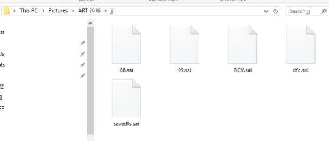
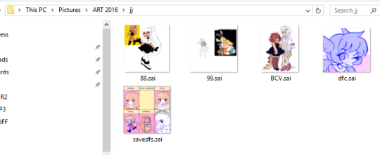

# SaiThumbs  

SaiThumbs is a Windows Shell extension that will allow image thumbnails for the `.sai` files produced from [SYSTEMAX's PaintTool Sai](https://www.systemax.jp/en/sai/).

Before:

After:

