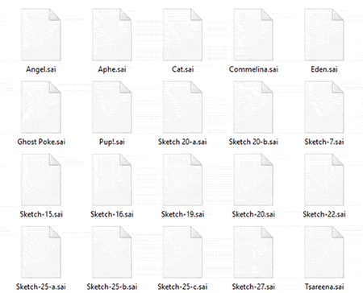
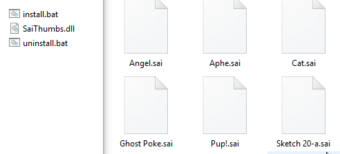
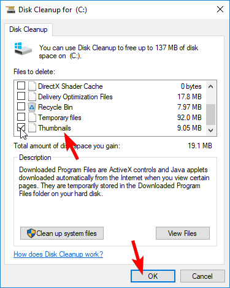

# SaiThumbs 

SaiThumbs is a Windows Shell extension that will allow image thumbnails for the `.sai` files produced from [SYSTEMAX's PaintTool Sai](https://www.systemax.jp/en/sai/).

### [Download the latest release here!](https://wunkolo.itch.io/saithumbs)

---

Between SaiThumbs installations and updates you ​may​ still see cached thumbnails for .sai files in explorer even after uninstalling or updating to a new SaiThumbs.dll. You can clear your thumbnail cache by running "Disk Cleanup" and selecting "Thumbnails" before cleaning.

